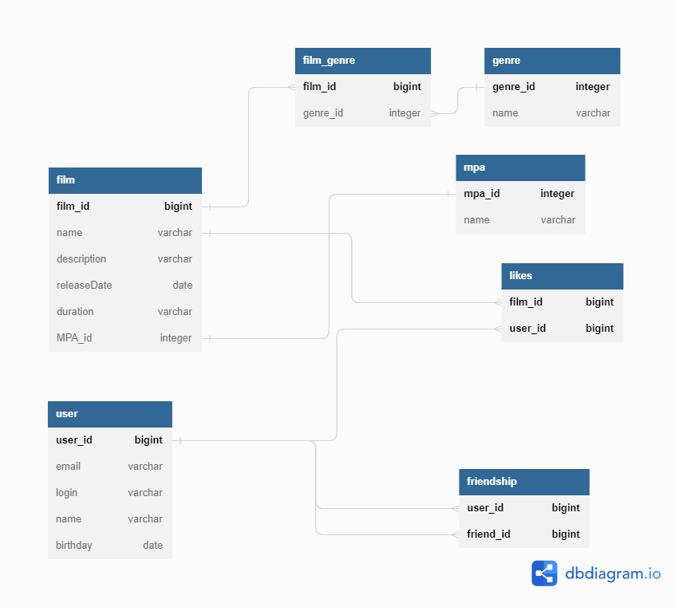

# java-filmorate
ER-диаграмма проекта Filmorate

Пример запроса на получение списка 5 наиболее популярных фильмов  

SELECT f.name,  
       COUNT(l.user_id) AS total_likes  
FROM film AS f  
LEFT OUTER JOIN likes AS l ON f.film_id = l.film_id  
GROUP BY f.name  
ORDER BY total_likes DESC  
LIMIT 5;

Пример запроса на получение числа друзей пользователя

SELECT u.user_id,  
       u.name,  
       COUNT(fs.friend_id) AS count_friends  
FROM user AS u  
LEFT JOIN friendship AS fs ON u.user_id = fs.user_id  
GROUP BY u.user_id  
HAVING fs.status = True; 

